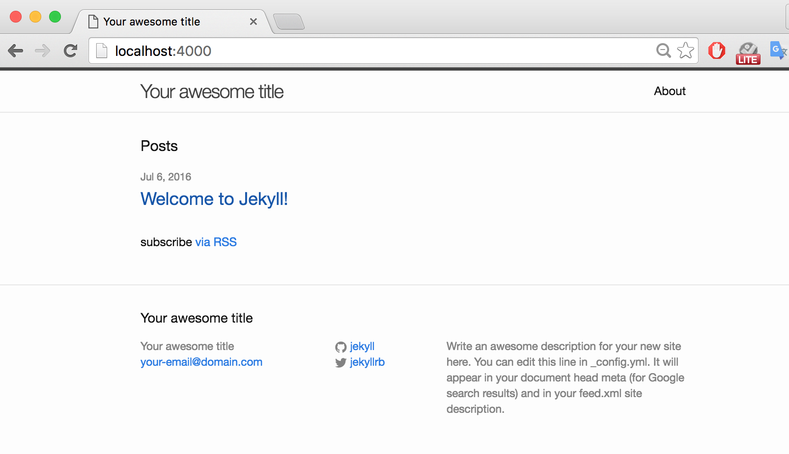
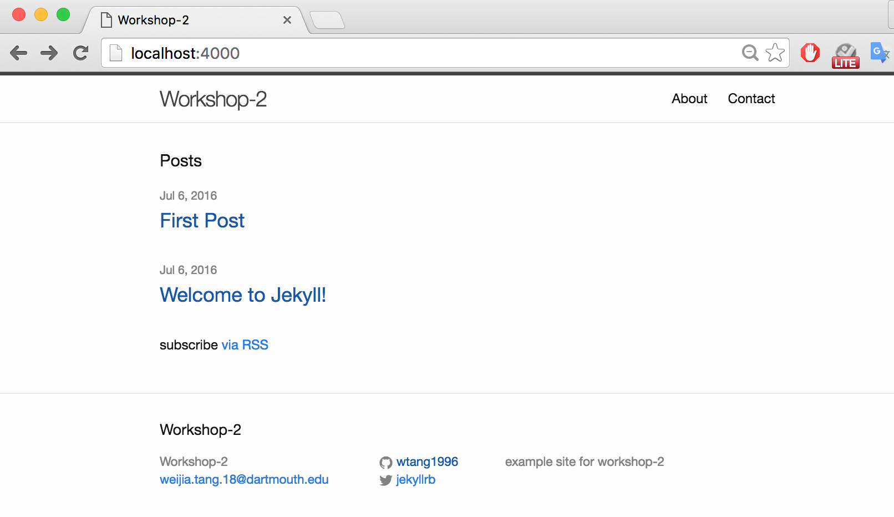

#Jekyll & Sass Workshop
Tutorial contents:
* [Welcome to Sass](#welcome-to-sass)
  * [Installation](#install-sass)
* [Sass Tutorial](#mini-sass-tutorial)
* [Welcome to Jekyll](#welcome-to-jekyll)


#Welcome to Sass
This will run you through a quick introduction to SASS, including **installation**, **basics**, and a simple first **project** to get you familiar with Sass.

###Install Sass
These instructions are for how to install on a mac using the :computer: terminal.
(If you are using a different OS then check this page for instructions: http://sass-lang.com/install )

1. **Run** `gem install sass` in terminal. This should install Sass and its dependencies. If it doesn't work, perhaps you need to run it using `sudo`, so `sudo gem install sass`.
2. **Check** that you have it installed by running `sass -v` and it should return what version of Sass you are running.

### Variables
Store info you want to reuse.
Can store:
 - colors
 - font stacks
 - any CSS value you want to reuse
Use `$` to make something a variable.

So for example if you get a font from [Font Awesome](https://fonts.google.com/) and want to save the **font stack** for "Merriweather" you can do it:
```sass
$font-stack: Merriweather, serif
```
and to save a **color**, say for the primary color of your page:
```sass
$primary-color: #ff7575
```
and then you could format that the body of your page. As you can see Sass is syntactically simpler than CSS in that you don't need to use brackets {} or semicolons ;
```sass
body
  font: $font-stack
  color: $primary-color
```

**How?** does it work?
Since Sass is a preprocesser, when it is processed, it takes the variables we defined and outputs normal CSS.

### Nesting
Nesting allows you to write Sass so that it's more hierarchical (and in this way, more similar to HTML). So instead of having to type out:
```CSS
nav ul {
 margin: 0;
 padding: 0;
 list-style: none;
}

nav li {
 display: inline-block;
}

nav a {
 padding: 6px;
 text-decoration: none;
}
```
in Sass you can nest the ul, li, and a components under nav.
```sass
nav
 ul
  margin: 0
  padding: 0
  list-style: none

 li
  display: inline-block;

 a
  padding: 6px;
  text-decoration: none
```
(This is also useful when formatting with divs and different class and id names).

### Mixins
With mixins we can create reusable chunks of CSS, which is helpful so we don't have to write a lot of repetitive code.
Instead of having to write out
```css
 a:link { color: white; }
 a:visited { color: blue; }
 a:hover { color: green; }
 a:active { color: red; }
```
in different parts of a large site, you can create a mixin.
To create a mixin you use the `$mixin` tag followed the name of the mixin followed by any inputs you want to pass in.
`$mixin mixin_name ($input1, $input2) {...` and then define the mixin within it.
This example even uses a variable as one of the inputs:
```sass
$base-color: pink;

@mixin headline($color, $size) {
 color: $color;
 font-size: $size;
}
``` and then to call it use `@include` and pass in the appropriate values (in the correct order):
```sass
h1 { @include headline($base-color, 12px);}
```
which would compile to:
```css
h1 {
 color: pink;
 font-size: 12px;
}
```
You can also set *default values* for the arguments, so from the example above:
``` sass
@mixin headline($size, $color: red) {
  color: $color;
  font-size: $size;
}

h1 {
  @include headline(12px);
}

h1 {
  @include headline(12px, blue);
}
```
Which would set the color to red in the first (by default) and then blue, since we pass in that argument.
### Inheritance
Again, Sass is meant to make your CSS coding life easier, and inheritance is another way to do that, instead of repeatedly typing out the `color`, `border`, `box-shadow`, `margin`, and `padding` properties over and over again with the same values:
```sass
.breakfast {
  color: #333;
  border: 1px solid #bbb;
  box-shadow: 1px 1px 0 #ddd;
  margin: 0 0 10px;
  padding: 15px;
}

.lunch {
  background-color: yellow;
  color: #333;
  border: 1px solid #bbb;
  box-shadow: 1px 1px 0 #ddd;
  margin: 0 0 10px;
  padding: 15px;
}

.dinner {
  background-color: orange;
  color: #333;
  border: 1px solid #bbb;
  box-shadow: 1px 1px 0 #ddd;
  margin: 0 0 10px;
  padding: 15px;
}
```
we can rewrite it with `@extend`:
```sass
.meal-box {
  color: #333;
  border: 1px solid #bbb;
  box-shadow: 1px 1px 0 #ddd;
  margin: 0 0 10px;
  padding: 15px;
}

.breakfast {
  @extend .meal-box;
}

.lunch {
  @extend .meal-box;
  background-color: yellow;
}

.dinner {
  @extend .meal-box;
  background-color: orange;
}
```
<p data-height="265" data-theme-id="0" data-slug-hash="BjZYVL" data-default-tab="css,result" data-user="SitePoint" data-embed-version="2" class="codepen"> See the Pen <a href="http://codepen.io/SitePoint/pen/BjZYVL/"> Duplication of Properties in SCSS</a> by SitePoint (<a href="http://codepen.io/SitePoint">@SitePoint</a>) on <a href="http://codepen.io"> CodePen </a> . </p>
<script src="//assets.codepen.io/assets/embed/ei.js"> </script>

### And so much more!
Sass has so many more options, such as allowing to split your CSS into smaller portions of code and saving those a snippets to **import** into a larger file,
```sass
// snippet: _reset.sass
html,
body,
ul,
ol
  margin:  0
  padding: 0
```
which can then be imported to the main or base file:
```sass
// base.sass

@import reset

body
  font: 100% Helvetica, sans-serif
  background-color: #efefef
```

, or even doing math with a few standard **math operators** `+`,`-`,`*`,`/`, and `%` which could be used as follows:
```sass
 .container
  width: 600px/960px * 100%
```
### Sass vs Scss??
Sass is the older syntax and extension name from when Sass was first released, but the new main syntax of Sass 3 is Scss and looks more like traditional CSS3 because of its use of brackets and semicolons while still maintaining Sass features such as Nesting.

#Mini Sass Tutorial
**Mixins** are some of the more confusing elements of Sass, so we're going to build a couple of simple mixins here to get an idea of what they can do.

**Where** to use Sass?
As you saw in SA3, one option (and the most commonly used when developing web pages and web apps) is to have a Sass processor which is part of your development environment. Another option, however is to use [Sassmeister](http://www.sassmeister.com/) to play around with Sass while you are getting used to it.

##Now try it:
###Make a Transitions Mixin that adds autoprefixes

Instead of having to type out the autoprefixes every time we make a transition, this mixin does it for us.
```scss
@mixin transition($args) {
  -webkit-transition: $args;
  -moz-transition: $args;
  -ms-transition: $args;
  -o-transition: $args;
  transition: $args;
}
```
now one possible use of it would be:
```scss
a {
  color: gray;
  @include transition(color .3s ease);
  &:hover {
    color: black;
  }
}
```
1. Try to guess what the processed css would look like for this mixin
2. Try it in [Sassmeister](http://www.sassmeister.com/)
3. Use the mixin for another separate implementation

###Create a Mixin for different Sized Screen Media queries:
```scss
@mixin bp-large {
  @media only screen and (max-width: 60em) {
    @content;
  }
}

@mixin bp-medium {
  @media only screen and (max-width: 40em) {
    @content;
  }
}

@mixin bp-small {
  @media only screen and (max-width: 30em) {
    @content;
  }
}
```
Usage:
```scss
.sidebar {
  width: 60%;
  float: left;
  margin: 0 2% 0 0;
  @include bp-small {
    width: 100%;
    float: none;
    margin: 0;
  }
  @include bp-medium {
    display: flex;
    flex-direction: column;
    padding: 2em;
  }
}
```
And again:

1. Try to guess what the processed css would look like for this mixin
2. Try it in [Sassmeister](http://www.sassmeister.com/)
3. Use the mixin for another separate implementation


**Sass Resources**:
* http://sass-lang.com/install
* http://sass-lang.com/guide
* https://www.sitepoint.com/the-benefits-of-inheritance-via-extend-in-sass/
* https://www.sitepoint.com/sass-basics-the-mixin-directive/
* https://scotch.io/tutorials/getting-started-with-sass
* http://zerosixthree.se/8-sass-mixins-you-must-have-in-your-toolbox/


#Welcome to Jekyll

### Goal
* Install Jekyll
* Create a custom website running on Jekyll
* publish first blog post and add another page
* Deploy a Jekyll site to GitHub pages
* Further customize the templates and style of website (if time allowed)

### Install Jekyll

#### System Requirements

1. Make sure Xcode Command Line Tools is installed.

*Only do this if you don't think you have them, no need to update right now*

```xcode-select --install```


2\. If you don't have Homebrew (everyone on OSX probably does), install it

```ruby -e "$(curl -fsSL https://raw.githubusercontent.com/Homebrew/install/master/install)"```


3\. Setup Ruby environment and download Ruby


```
brew install rbenv ruby-build

#Add rbenv to bash so that it loads every time you open a terminal
echo 'if which rbenv > /dev/null; then eval "$(rbenv init -)"; fi' >> ~/.bash_profile
source ~/.bash_profile

Install Ruby
rbenv install 2.2.2
rbenv global 2.2.2
ruby -v
```

As a sidenote, if you ever start working with ruby and gems you should also install Bundler, Ruby's package manager. Like ```npm``` in Node, manages dependencies. We won't need it today, so let's get started.


#### Installing Jekyll

With Ruby set up, all you need to do to install Jekyll is run:

```gem install jekyll```

Check successful install with

```jekyll -v```

#### And We Are Ready! Let's Make a Site

### Start a new project
Now you have successfully installed Jekyll, let's start a new project
```sh
$ jekyll new project-name
```
The `new` command will create an install of Jekyll with the default theme. Move to the new directory `cd project-name` and checkout all the files and subdirectories with `atom .`

Jekyll comes with a built-in development server.
```sh
$ jekyll serve
```
The command starts this server and starts watching your files for changes similar to Grunt or Gulp. Any time you make a change, the server will build your site automatically. You can now go to `http://localhost:4000` and will see the Jekyll install we just setup.



You can stop the server using `ctrl-c`.

### Configuration
Let's start customizing your website. The file `_config.yml` hosts global configurations for your entire site. It looks like this:
```yaml
# Site settings
title: Your awesome title
email: your-email@domain.com
description: > # this means to ignore newlines until "baseurl:"
  Write an awesome description for your new site here. You can edit this
  line in _config.yml. It will appear in your document head meta (for
  Google search results) and in your feed.xml site description.
baseurl: "" # the subpath of your site, e.g. /blog/
url: "http://yourdomain.com" # the base hostname & protocol for your site
twitter_username: jekyllrb
github_username:  jekyll

# Build settings
markdown: kramdown
```
Some settings above such as `email`, `twitter_username` can be used as global variables as you can retrieve them in templates like so
```yaml
{{ site.variable_name }}
```

One important thing to notice is that changes made to `_config.yml` will not be watched by `jekyll serve`. You must restart the server after changes. Also, all indentation is mandatory and must be made with two spaces, or else the file will not work.

Now go ahead and customize your website by updating the variables! You can leave the url and baseurl unchanged as we are going to cover them later.

### Publish your first blog post
Create a markdown file under `_posts/` directory and set the file name to include today's date and the title of your post. Jekyll requires posts to be in this format:
`year-month-day-title.md`
This is going to be automatically parsed by Jekyll and it will create default title and date variables.

At the top of the markdown file, you have to include the front-matter block so that the file can be processed by Jekyll. You can always override the title and date variables here. Here's an example of a post's front-matter:

```yaml
---
layout: post
title:  "First Post"
date:   2016-07-06 17:58:35
categories: blog development
---

Write your content here.

```
Jekyll uses the Liquid templating language to process templates. A front-matter block is included at the beginning of every YAML content file. It specifies the layout of the page and some other variables. Later in templates, you can actually access these front-matter variables with liquid by doing
```yaml
{{ page.variable_name }}
```

More about the front-matter can be found here: https://jekyllrb.com/docs/frontmatter/

You can run `jekyll serve` again and check out your post.

### Create a new page
It's pretty similar to create a new page. Create a folder called `_pages` in root directory so we can better organize our pages. In addition to that, you have to add the following line to your `_config.yml`
```yaml
include: [`_pages`]
```
You should delete `about.md` from the main directory and put it in the `_pages` directory.

Then just create a file that's either `.html`, `.markdown`, `.md` or `.textile`. Also don't forget to add front matter. It can include any variables you want but it has to at least contain `layout`, `title` and `permalink`. An example page:
```yaml
---
layout: page
title: Contact
permalink: /contact/
---

Content goes here.

```
When Jekyll builds the site, it will parse informatino at the top, generates a page accessible at the URL `/about`, and make sure it uses the layout that's named 'page'.

Your website should start to look like this:



#### Note
`_site` folder is your generated static website. **Never** place any files in that folder, otherwise they will be deleted and overwritten.

### Pushing Jekyll to Github pages
Change the baseurl and url variable in your `_config.yml` file to
```yaml
baseurl: "/project-name"
url: "http://github-username/github.io"
```
Serve your Jekyll one last time. Checkout to the `gh-pages` branch and then push.

### Customize your theme
Now you might want to customize the layout and style of your website. We will do this by going through all the folders.

#### _layouts
This is where you put your templates, which are the HTML that wrap posts and other types of content like pages. Most simple blog websites need only two layout files: one for blog posts (post.html) and one for static pages(page.html). If you create a file with an .html or .md extension in the root, it will be treated as a static page. For example, about.md would be outputted as http://github-username/github.io/project-name/about.

Here's the template for page:
```html
---
layout: default
---
<article class="post">

  <header class="post-header">
    <h1 class="post-title">{{ page.title }}</h1>
  </header>

  <div class="post-content">
    {{ content }}
  </div>

</article>
```
Notice that you also have to include front matter at the top. For pages and posts, the default layout gets loaded, plus any additional layout information you desire.

You may notice the double curly braces in the template. They are part of the **Liquid template tags** that are used to execute loops and conditional statements and to output content. In `page.html`, `{{ page.title }}` and `{{ content }}` output the title and content of the blog post. In addition, single curly braces and modules are used for conditionals and loops and for displaying includes. You can learn more about Liquid here: https://github.com/Shopify/liquid/wiki/Liquid-for-Designers.

Feel free to customize the layout of page and post!

I added a few lines to the template above:
```html
<div class="post-content">
  {{ content }}
  <p> {{ site.email }} </p>
  <p> {{ site.twitter_username }} </p>
  <p> {{ site.github_username }} </p>
</div>
```
I put the global variables we set in `_config.yml` into the template, so every new page would contain my `email`, `twitter_username` and `github_username` below its content. Here's the screen shot of my contact page:


#### _includes
These are templates that show up on every page - header, footer, etc. They also use the liquid templating language.

#### index.html
This is the homepage of your website. It will be automatically transformed by Jekyll as long as it has a front matter.

#### _sass
Jekyll can build SASS by default that you can include your `.sass` anywhere and Jekyll will process it, outputting a `.css` file. Don't forget to start the file with two lines of triple hyphens as front matter. Also, if you are using `@imports` to break out your Sass into partials, you have to include the following line in your `_config.yml` file.
```yaml
sass:
  sass_dir: _scss
```
Go ahead and customize the style of your websites!


### Data Files
To integrate external data with a Jekyll website, you can use data files. Jekyll is able to read `YAML` and `JSON` files from the `/_data` folder, allowing you to use them in your templates just like other variables. More information could be found here: http://jekyllrb.com/docs/datafiles/.


**Jekyll sources**:
* https://jekyllrb.com/docs/home/
* https://www.taniarascia.com/make-a-static-website-with-jekyll/
* https://www.smashingmagazine.com/2014/08/build-blog-jekyll-github-pages/
* https://scotch.io/tutorials/getting-started-with-jekyll-plus-a-free-bootstrap-3-starter-theme
